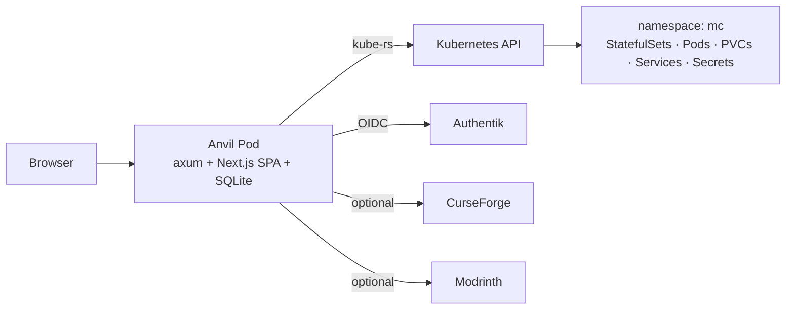

# Anvil

**A Kubernetes-native Minecraft server panel.** Each Minecraft server is a
StatefulSet + PVC + Service triple, managed imperatively from one Rust
binary. No CRDs, no controller, no Node runtime — one image, one Pod, one
SQLite file, and direct `kube-rs` calls.

[](LICENSE)


## Why

Existing panels (Crafty Controller, Pterodactyl) treat Kubernetes as an
afterthought — they assume Docker on a single host. Anvil is built the
other way around: a Kubernetes cluster is the runtime, and a Minecraft
server is just a particular shape of `StatefulSet`. That makes scale-to-zero
trivial (`replicas: 0`), gives you per-server PVCs for free, and lets you
ship the panel itself as a single Pod.

## At a glance



- **Imperative, not an operator.** Each user click maps to one or more
  direct Kubernetes API calls. The k8s API itself is the runtime state
  store; SQLite holds metadata + audit log only.
- **One binary.** The Rust backend embeds the Next.js static export via
  `rust-embed`. Distroless image, ~30 MB. No Node runtime in production.
- **Live status, never cached.** Server status (running / stopped /
  starting / stopping / error) is derived from `replicas`, `readyReplicas`
  and Pod phase every time it's read.

## Features

- **Lifecycle:** create, start, stop, restart, delete; resize PVC online.
- **Modpacks:** CurseForge ServerFiles, Modrinth modpacks, full
  modded (Fabric / Forge / NeoForge) with mod search + dependency
  resolution, Paper plugins.
- **Updates:** orchestrated FSM (announce → stop → backup → swap →
  start → verify) with automatic rollback to a tar snapshot on failure.
- **Files tab:** in-browser file browser over `pods/exec` (works even when
  the server is stopped, via a lazy helper Pod).
- **Players tab:** RCON-driven kick / ban / op / gamemode / whitelist /
  broadcast, plus join/leave history scraped from pod logs.
- **Live console:** WebSocket log tail with auto-reconnect on pod restart.
- **Backups:** on-demand tar-to-PVC snapshots with one-click restore.
- **Auth:** Authentik OIDC (Authorization Code + PKCE) with optional
  per-subject allowlist.
- **Metrics:** live CPU and memory from `metrics-server` (when installed).

## Quickstart (Helm)

The chart is published as an OCI artifact in the project's container
registry. Full guide in [`docs/deployment.md`](docs/deployment.md).

```bash
kubectl create ns mc

helm install anvil oci://gitlab.cherkaoui.ch/hadicherkaoui/anvil/anvil \
  --version 1.0.10 \
  --namespace anvil --create-namespace \
  --set mcDefaults.storageClassName=<your-storage-class> \
  --set mcDefaults.filesHelperImage="alpine@sha256:<digest>" \
  --set oidc.enabled=true \
  --set oidc.issuerUrl="https://authentik.example.com/application/o/anvil/" \
  --set oidc.clientId="<id>" --set oidc.clientSecret="<secret>" \
  --set oidc.redirectUrl="https://anvil.example.com/api/auth/callback" \
  --set oidc.sessionKey="$(openssl rand -base64 32)" \
  --set ingress.enabled=true --set ingress.host="anvil.example.com" \
  --set ingress.tls.enabled=true \
  --set modpack.snapshotsPvc.enabled=true
```

Confirm liveness:

```bash
kubectl -n anvil port-forward svc/anvil 8080:8080
curl http://localhost:8080/api/health   # → {"ok":true,"version":"1.0.0"}
```

## Quickstart (development)

You need Rust 1.83+ (edition 2024), Node 22+, and `pnpm`.

```bash
# Build the frontend bundle once
cd frontend && pnpm install && pnpm build && cd ..

# Run the backend with the dev static-serve feature.
# Provide enough env to satisfy Config::from_env (see backend/src/config.rs).
cd backend
ANVIL_MC_STORAGE_CLASS=tank \
ANVIL_OIDC_ISSUER_URL="https://authentik.example.com/application/o/anvil/" \
ANVIL_OIDC_CLIENT_ID="..." \
ANVIL_OIDC_CLIENT_SECRET="..." \
ANVIL_OIDC_REDIRECT_URL="http://localhost:8080/api/auth/callback" \
ANVIL_SESSION_KEY="$(openssl rand -base64 32)" \
ANVIL_MODPACK_SNAPSHOTS_PVC=mc-snapshots \
ANVIL_FILES_HELPER_IMAGE=alpine:3.20 \
cargo run --features serve-dir
```

Then visit <http://localhost:8080>.

For backend tests:

```bash
cd backend
cargo fmt --all
cargo clippy --all-targets --features serve-dir -- -D warnings
cargo clippy --all-targets --features embed     -- -D warnings
cargo test --features serve-dir --locked
```

For frontend checks:

```bash
cd frontend
pnpm typecheck
pnpm lint
```

## Stack

| Layer | Tech |
|---|---|
| Backend | Rust 2024 · axum 0.8 · kube-rs 3.x · sqlx (SQLite, offline mode) · openidconnect 4 · rust-embed |
| Frontend | Next.js 16 (App Router, `output: 'export'`) · React 19 · TypeScript (strict) · Tailwind v4 · Zod |
| Build | Multi-stage Dockerfile → distroless `cc-debian12:nonroot` |
| Runtime | k0s-tested · single Deployment (`Recreate`) · 1 GiB PVC for SQLite |
| Auth | Authentik OIDC (Authorization Code + PKCE) · HS256 session JWT |

## Documentation

| Document | What it covers |
|---|---|
| [`docs/architecture.md`](docs/architecture.md) | System diagram, lifecycle, FSMs, OIDC flow, file browser, build modes. **Start here to understand the codebase.** |
| [`docs/api.md`](docs/api.md) | Complete HTTP + WebSocket reference. Every endpoint, every error code. |
| [`docs/deployment.md`](docs/deployment.md) | Operator guide: cluster prereqs, Helm values, RBAC, sizing, troubleshooting. |
| [`docs/spec-v1.md`](docs/spec-v1.md) | Brainstormed v1 specification — source of truth for the M1–M3 contract. |
| [`docs/milestones.md`](docs/milestones.md) | Shipped milestones with deltas vs the spec. |
| [`docs/cluster-profile.md`](docs/cluster-profile.md) | Reference homelab cluster capabilities (k0s + Cilium + OpenEBS ZFS + Authentik + Traefik). |
| [`docs/authentik-setup.md`](docs/authentik-setup.md) | Step-by-step Authentik provisioning runbook. |
| [`docs/decisions/`](docs/decisions/) | Architecture decision records (0001–0006). |
| [`CLAUDE.md`](CLAUDE.md) | Contributor / agent operating rules. |

## Non-goals

| Capability | Why not |
|---|---|
| Custom auth UI / signup | Authentik handles users. |
| Multi-tenancy / per-user ACLs | Authentik group membership is the only access control. |
| Multi-cluster | Out of scope. One cluster, one panel. |
| File management for files > 100 MiB | Use `kubectl cp` for big assets. |
| Operator pattern with CRDs | Rejected by [ADR 0001](docs/decisions/0001-imperative-not-operator.md) — there's nothing to reconcile between user actions. |
| Multi-replica MC | Rejected by [ADR 0002](docs/decisions/0002-statefulset-replicas-as-lifecycle.md) — one JVM per server. |

## License

[AGPL-3.0-or-later](LICENSE).
