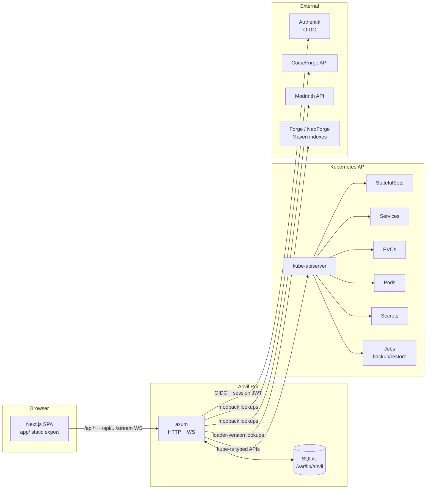
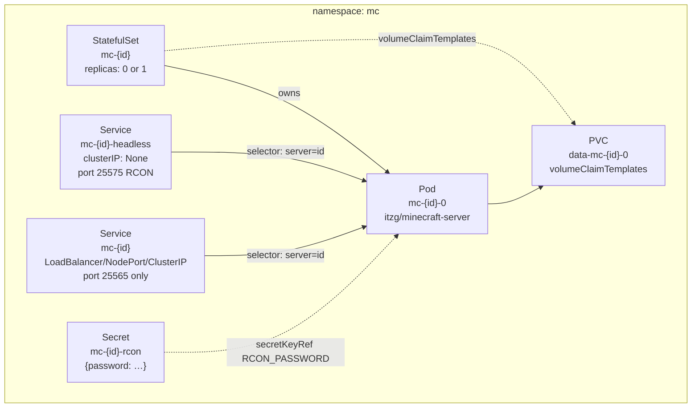
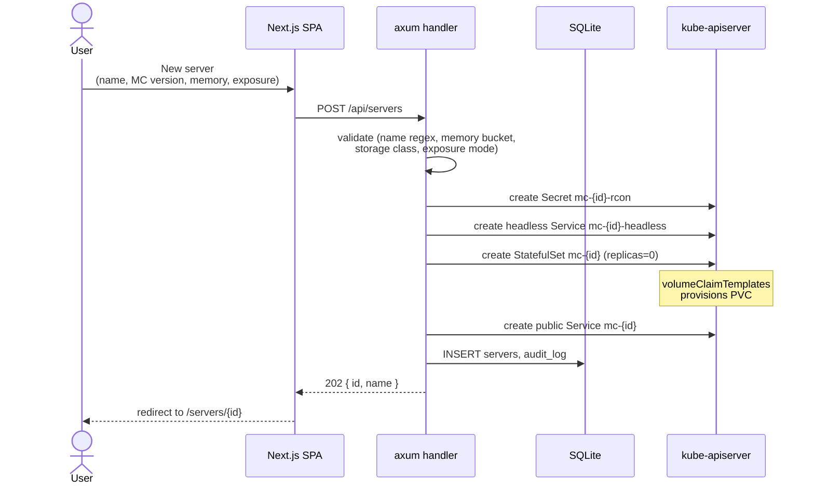
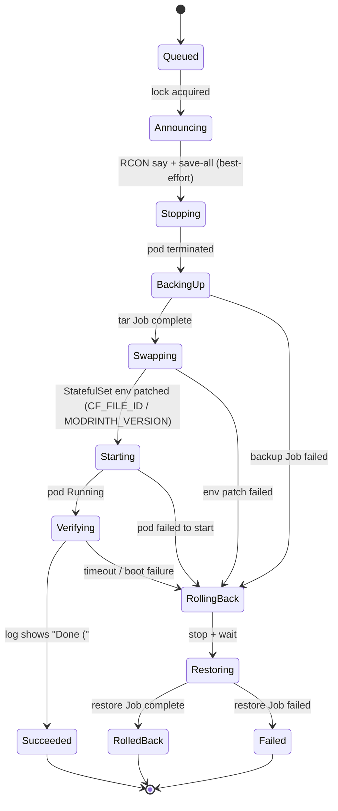
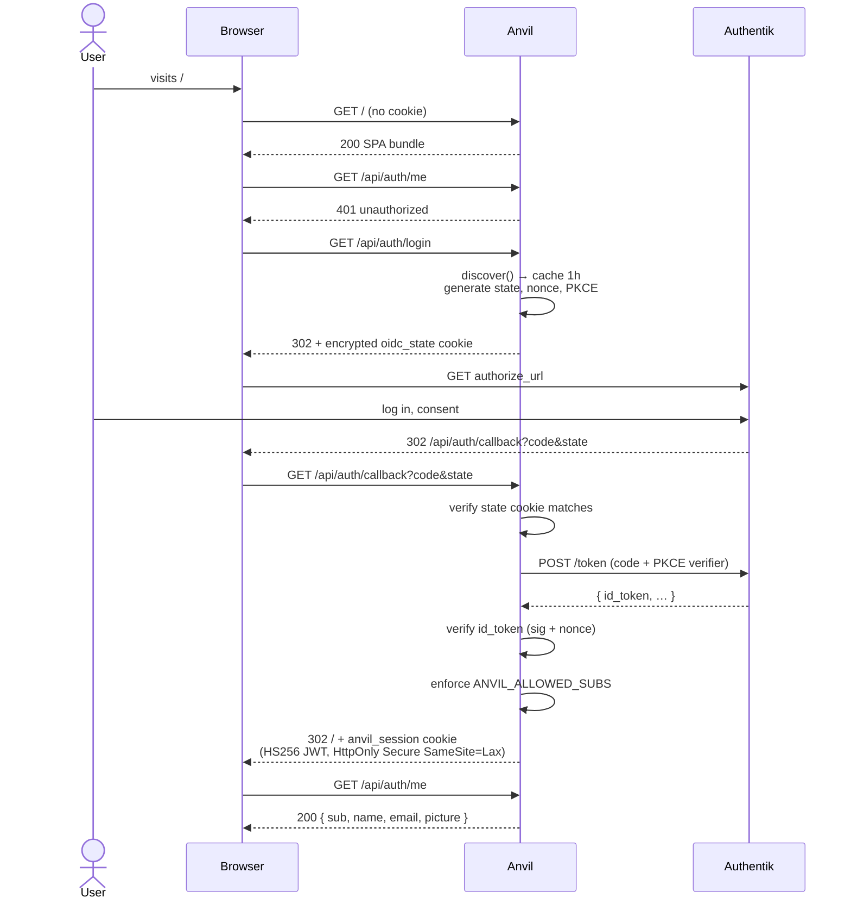

# Architecture

This document explains how Anvil works end-to-end — what runs where, how user
actions become Kubernetes API calls, and what each subsystem is responsible
for. It is the single best place to start if you want to understand or extend
the codebase.

## Contents

- [System overview](#system-overview)
- [Two storage planes: k8s API and SQLite](#two-storage-planes-k8s-api-and-sqlite)
- [Per-server resource topology](#per-server-resource-topology)
- [Lifecycle: how a click becomes a k8s call](#lifecycle-how-a-click-becomes-a-k8s-call)
- [Status: live, never cached](#status-live-never-cached)
- [Modpack subsystem (CurseForge / Modrinth / modded / Paper)](#modpack-subsystem-curseforge--modrinth--modded--paper)
- [Update orchestrator FSM](#update-orchestrator-fsm)
- [Authentication: Authentik OIDC + session JWT](#authentication-authentik-oidc--session-jwt)
- [File browser via `pods/exec`](#file-browser-via-podsexec)
- [Background work: poller, restart, restore](#background-work-poller-restart-restore)
- [Caches](#caches)
- [WebSocket streams](#websocket-streams)
- [Static frontend serving (`serve-dir` vs `embed`)](#static-frontend-serving-serve-dir-vs-embed)
- [Configuration surface](#configuration-surface)
- [Code map](#code-map)
- [Architectural decisions](#architectural-decisions)

---

## System overview

Anvil is an **imperative panel**, not a Kubernetes operator. A user click
maps to one or more direct Kubernetes API calls; there is no CRD and no
reconciliation loop. The k8s API itself is the runtime state store. SQLite
holds creation-time metadata, an audit log, and provider-specific config.



The Anvil pod runs as a `Deployment` (single replica, `Recreate` strategy)
with a small PVC for SQLite. It serves both the React UI bundle and the
`/api/*` endpoints from one binary on one port (8080).

Managed Minecraft servers live in a separate namespace (`mc` by default) so
RBAC for them is scoped tightly: Anvil holds `get/list/watch/create/update/
patch/delete` on `apps/statefulsets`, `core/services`, `core/persistentvolume
claims`, `core/pods`, `core/pods/log`, `core/pods/exec`, `core/secrets`, and
`batch/jobs` in that namespace, plus a `ClusterRole` for read-only listing
of `storage.k8s.io/storageclasses`.

## Two storage planes: k8s API and SQLite

**k8s API is the source of truth for runtime state.** The current status of
a server (running / stopped / starting / stopping / error) is **never** read
from SQLite — it is derived live from the StatefulSet's `replicas`,
`readyReplicas`, and the Pod's phase. This means:

- An Anvil pod restart loses no operational state.
- An admin who edits a StatefulSet via `kubectl` is in sync with the panel.
- Status lies are impossible — the panel cannot drift from the cluster.

**SQLite stores three things and only three things:**

| Table | Purpose |
|---|---|
| `servers` | Snapshot of create-time config (name, MC version, memory, exposure mode, storage class, source kind, JSON `source_config`, NodePort assignment). |
| `audit_log` | Append-only timeline of mutating actions — created, started, stopped, restarted, deleted, plus modpack/update/restore variants. **`server_id` is intentionally not a foreign key** so audit history survives server deletion. |
| `modpack_versions`, `mod_updates`, `backups` | Per-server caches and bookkeeping for the modpack and backup subsystems. |

`storage_class`, `storage_size_gi`, and `exposure_mode` are snapshotted at
create time so changing the cluster defaults later doesn't retroactively
alter existing servers' apparent config.

Migrations live under [`backend/migrations/`](../backend/migrations/) and run
on startup. SQLX offline mode (`.sqlx/` lockfiles) is used so CI can compile
the backend without a live DB.

## Per-server resource topology

Each managed Minecraft server is **exactly four Kubernetes resources** plus
the auto-bound PVC:



Why this shape:

- **`StatefulSet` with `replicas` ∈ {0, 1}** lets "stopped" mean *no compute,
  data preserved*. Scaling to 0 keeps the PVC bound; scaling to 1 starts the
  same world. Pod name is stable (`mc-{id}-0`), which makes log-tailing and
  `pods/exec` deterministic. (See [ADR 0002](decisions/0002-statefulset-replicas-as-lifecycle.md).)
- **Two Services per server.** The public one carries only port 25565
  (Minecraft) — RCON is **never** exposed publicly. RCON lives behind the
  headless Service at `mc-{id}-headless.{ns}.svc:25575`, reachable from the
  Anvil pod only.
- **Per-server RCON Secret.** Password is generated once at create time as
  24 random alphanumerics, stored in `mc-{id}-rcon`, and referenced by the
  pod's `RCON_PASSWORD` env via `secretKeyRef`. Anvil reads it back when it
  needs to send a command.
- **Labels:** every resource carries `app.anvil.io/managed-by=anvil` and
  `app.anvil.io/server={uuid}`. Selectors and lookups work off these labels;
  the resource name `mc-{id}` is also derivable from the row's UUID.
- **Annotations on the StatefulSet** snapshot `mc-version`, `memory-mi`,
  `server-name`, and `created-at` — the panel reads these back when the DB
  row and the cluster state need to be merged for display.

## Lifecycle: how a click becomes a k8s call

Every mutation is direct — no controller is in the loop. The audit log
records what API call was made and when, which makes failures debuggable.



Start, stop, restart, and delete follow the same pattern (see
[`backend/src/routes/servers/`](../backend/src/routes/servers/)):

| Action | Direct k8s effect |
|---|---|
| **Start** (`POST /start`) | Patches `spec.replicas=1` on the StatefulSet via the `/scale` subresource. Tears down any files-helper Pod first. Writes `audit_log(action=started)`. |
| **Stop** (`POST /stop`) | Patches `spec.replicas=0`. The Pod terminates; the PVC stays bound. |
| **Restart** (`POST /restart`) | **Async**: returns 202 immediately and spawns a tokio task that stops, polls until the pod is gone (90s timeout), then starts. Progress observable via the audit log. |
| **Delete** (`DELETE`) | Ordered teardown: rejects with 409 `must_be_stopped` if `replicas ≥ 1`, then deletes StatefulSet → waits for pod → deletes PVC → public Service → headless Service → Secret → SQLite row. |
| **Resize** (`PATCH /storage`) | Grow-only PVC patch. Rejects 409 `expansion_unsupported` if the StorageClass lacks `allowVolumeExpansion=true`. |
| **Settings** (`PATCH /settings`) | Updates memory or modpack toggles. Memory is patched live on the StatefulSet env (visible to the next pod start) and persisted in SQLite. |

## Status: live, never cached

`status` for any server is computed from the cluster, not stored:

| `replicas` | `readyReplicas` | Pod phase | → status |
|---|---|---|---|
| 1 | 1 | Running | `running` |
| 1 | 0 | Pending / ContainerCreating | `starting` |
| 0 | n/a | Pod absent | `stopped` |
| 0 | n/a | Pod still Terminating | `stopping` |
| any | any | CrashLoopBackOff / OOMKilled / similar | `error` |

The endpoint (`{ host, port }`) is similarly derived: Anvil reads
`Service.status.loadBalancer.ingress[0].ip` for `LoadBalancer`, the configured
`ANVIL_NODE_HOST` plus the assigned `nodePort` for `NodePort`, and the
`ClusterIP` otherwise. `null` until the LB IP shows up.

See [`backend/src/k8s_status.rs`](../backend/src/k8s_status.rs) for the full
derivation, and [§2.4 of `spec-v1.md`](spec-v1.md#24-status-enum) for the
original spec table.

## Modpack subsystem (CurseForge / Modrinth / modded / Paper)

Anvil supports five `source_kind`s. The discriminator drives a
`ModpackProvider` trait implementation chosen at runtime:

| `source_kind` | What it runs | Source of mods/pack |
|---|---|---|
| `vanilla` | `itzg/minecraft-server` with `TYPE=VANILLA` | none |
| `curseforge` | `itzg/minecraft-server` with `TYPE=AUTO_CURSEFORGE` | upstream pack zip via CF API; key required |
| `modrinth` | `itzg/minecraft-server` with `TYPE=MODRINTH` | Modrinth modpack version; no key |
| `modded` | `itzg/minecraft-server` with `TYPE=FABRIC` / `FORGE` / `NEOFORGE` | individual mods picked from Modrinth/CurseForge, applied via a sync FSM |
| `paper` | `itzg/minecraft-server` with `TYPE=PAPER` | individual plugins picked from Modrinth/CurseForge |

Provider trait lives in [`backend/src/modpack/mod.rs`](../backend/src/modpack/mod.rs).
It uses `#[async_trait]` because the update orchestrator holds a
`Box<dyn ModpackProvider + Send + Sync>` that outlives a single request — see
[ADR 0006](decisions/0006-modpack-trait-and-tar-backup.md).

A `ModpackProvider` knows how to:

- Render the per-server pod image, command override, and env vars.
- (For pack-shaped providers) look up the latest version and produce a
  download URL the swap step can feed into the pod env.
- Boot-verify by tailing the pod log for a "Done (" line within a
  provider-specific timeout.

The hourly **modpack poller** (`backend/src/modpack/poller.rs`, spawned in
`main.rs`) walks every server with a pack-shaped `source_kind`, asks the
provider for the latest version, and writes `modpack_versions`. The poller
also walks every modded/paper server and refreshes `mod_updates` from
Modrinth/CurseForge so the UI can show "X updates available". When a
server has `auto_update_mode=apply` and a new version is available, the
poller fires the update orchestrator inline.

## Update orchestrator FSM

The orchestrator (`backend/src/modpack/orchestrator.rs`) is the single
in-flight unit that mutates a server's state during a pack update. It runs
in a tokio task; phase transitions are emitted to a `watch::Sender` so the
WS at `/api/servers/:id/update/stream` can stream them to the UI.



Key invariants:

- A per-server **update lock** (`update_locks: HashSet<String>` in `AppState`)
  prevents concurrent updates of the same server.
- A panel-wide **snapshot PVC mutex** (`Arc<AsyncMutex<()>>`) serializes
  backup, swap, and restore Jobs because the shared `mc-snapshots` PVC is
  RWO on single-node ZFS — only one Job can mount it at a time.
- The swap step is just a StatefulSet env patch (`CF_FILE_ID` /
  `MODRINTH_VERSION`). The `itzg/minecraft-server` image redownloads its
  pack on next boot when the env changes. No bespoke unzip/preserve script
  is needed.
- Backups are **tar-to-PVC**, not VolumeSnapshots. The cluster has the
  VolumeSnapshot CRDs but no `VolumeSnapshotClass` for `zfs.csi.openebs.io`,
  so snapshots wouldn't work without further setup. Tar costs an extra Job
  and ~7 GB × 3 retained per server, which is fine at homelab scale. See
  [ADR 0006](decisions/0006-modpack-trait-and-tar-backup.md).

The same orchestrator (slightly trimmed) backs the **mods-apply** and
**plugins-apply** FSMs for modded and Paper servers, exposed via
`/api/servers/{id}/mods/apply` and `/api/servers/{id}/plugins/apply`. They
emit the same WS frame schema with a smaller phase set.

## Authentication: Authentik OIDC + session JWT

Anvil uses **Authorization Code + PKCE** against Authentik. The cookie
issued after login is **Anvil's own HS256 JWT**, not the Authentik ID token,
which keeps the session check off the hot path (no JWKS round-trip on every
request).



- Provider metadata (issuer + JWKS) is cached for 1 hour in the
  `OidcState` struct.
- The OIDC-state cookie is **encrypted** with a key derived from
  `ANVIL_SESSION_KEY` via `cookie_key.derive_from`. It carries the CSRF
  token, nonce, and PKCE verifier, lives a few minutes, and is cleared on
  callback.
- The session JWT lives 8 hours by default. Rotating `ANVIL_SESSION_KEY`
  invalidates all active sessions (no revocation list).
- `require_session` middleware (in [`backend/src/auth/middleware.rs`](../backend/src/auth/middleware.rs))
  is mounted on every `/api/*` route except `/api/health`,
  `/api/auth/login`, and `/api/auth/callback`. WebSocket upgrades are
  inside the middleware-wrapped subtree, so logging out kills live tails on
  the next reconnect.
- `ANVIL_ALLOWED_SUBS` is an optional comma-separated allowlist of
  Authentik subject UUIDs. When empty, any user the Authentik application
  is bound to can sign in. When non-empty, mismatched subjects get
  `403 sub_not_allowed`.

The full Authentik provisioning runbook lives in
[`docs/authentik-setup.md`](authentik-setup.md).

## File browser via `pods/exec`

The file tab does not run a sidecar or expose a separate file daemon. Anvil
streams `tar` over `kube::Api<Pod>::exec` to read and write `/data` inside
the running MC pod. When the server is stopped, Anvil lazily spawns a tiny
helper Pod (`mc-{id}-files`, `alpine + sleep infinity`) that mounts the same
data PVC and tears down on next start.

```mermaid
flowchart LR
    Browser -- "GET /api/servers/{id}/files?path=/" --> AX[axum]
    AX -- "is server running?" --> K[(k8s)]
    K -- yes --> EX[pods/exec on mc-{id}-0]
    K -- no, helper running --> EX2[pods/exec on mc-{id}-files]
    K -- no, no helper --> SP[create helper Pod] --> EX2
    EX --> AX
    EX2 --> AX
    AX -- "JSON listing / file bytes" --> Browser
```

Operations:

| Verb | Implementation |
|---|---|
| **list** | `ls -la --time-style=+%s` parsed into `{ name, type, size, mtime }` rows |
| **upload** (PUT) | Body streamed into a tmp path with `cat > tmp && mv tmp dest` (atomic). Body limit 100 MiB. |
| **download** | `cat` streamed back as `application/octet-stream` |
| **mkdir / rename / delete** | `mkdir -p`, `mv`, `rm` (`-rf` only when `recursive=true`) |
| **kill helper** | DELETE `/api/servers/{id}/files/helper` removes the helper Pod (rejected if the server is running) |

Path validation rejects empty segments, `.`/`..`, leading dashes, control
characters, and paths > 4 KiB. `/` is the only "root" — operations cannot
target it.

The helper image is pinned by digest via `mc.filesHelperImage` in the Helm
chart so a tag-mutation supply-chain attack can't swap the image out from
under us. Default is `alpine:3.20`, but pin to your own mirror in
production. See [ADR 0006-style discussion in the M5 spec](milestones.md#m5--modpack-support-curseforge-serverfiles)
for sub-project D context.

## Background work: poller, restart, restore

Anvil's tokio runtime carries a small fixed set of long-running tasks:

| Task | Where it lives | What it does |
|---|---|---|
| **Modpack poller** | spawned in `main.rs`, `modpack::poller::run` | Hourly: refreshes `modpack_versions` for pack servers and `mod_updates` for modded/Paper servers; auto-applies if `auto_update_mode=apply`. |
| **Restart task** | spawned per request in `routes/servers/restart.rs` | Stop → poll until pod gone (90s) → start. Returns 202 immediately. |
| **Update / mods-apply / plugins-apply orchestrator** | spawned per request | Whole FSM described above. |
| **Backup / restore Jobs** | spawned via `kube::Api<Job>` | One-shot pod that tars `/data` to (or restores from) the `mc-snapshots` PVC. |
| **Files-helper Pod** | spawned per file-tab session | Lives until the server starts or the user explicitly tears it down. |

There is **no global event bus**, no message queue, no leader election —
Anvil is a single-replica panel and assumes it. Concurrency is controlled
by the in-process locks (`update_locks: Mutex<HashSet>`,
`snapshot_pvc_lock: Mutex<()>`).

## Caches

All caches are in-process `RwLock<Option<…>>` with a TTL. None are external.

| Cache | TTL | Purpose |
|---|---|---|
| OIDC provider metadata | 1 hour | `discover()` round-trip on `/login` and `/callback` |
| Cluster capabilities (`/api/cluster/capabilities`) | 5 minutes | StorageClass list + LB/NodePort/ClusterIP availability |
| MC versions (`/api/cluster/mc-versions`) | 24 hours | Top 20 release versions from Mojang's manifest, with a hardcoded fallback list if Mojang is down |
| Loader versions (`/api/runtimes/{forge,neoforge}/versions`) | 1 hour | Maven indexes; stale cache served on upstream failure |
| CurseForge `/files` | 1 hour | Per-project version lookup |

A pod restart drops every cache; cold misses are bounded by the TTL costs
above, all of which are seconds-of-latency at most.

## WebSocket streams

Three live streams. All run inside the `require_session` subtree, all use
typed JSON frames, and all heartbeat with WS Ping every 30 seconds.

| Path | Frame schema | Behaviour |
|---|---|---|
| `GET /api/servers/{id}/logs/stream` | `hello` / `log` / `error` / `end` | Replays the last 2000 log lines, then live-tails. On pod restart, server-side re-attaches up to 60s and emits a fresh `hello`. After 60s pod-unavailable, emits `end{reason:pod-unavailable}` and closes. |
| `GET /api/servers/{id}/update/stream` | `hello` / `progress` / `done` / `end` | Streams `UpdatePhase` transitions. If no update is running, sends `end{reason:no-update-in-progress}` and closes. Terminal `done.result` is `succeeded`, `failed-rolled-back`, or `failed`. |
| `GET /api/servers/{id}/mods/apply/stream` *and* `…/plugins/apply/stream` | Same shape as update | Streams the mods-apply / plugins-apply FSM. `done.result` is `succeeded` or `failed`. |

The frontend hooks (`app/lib/logs-stream.ts`, `app/lib/update-stream.ts`,
`app/lib/use-mod-apply-stream.ts`) all share the same pattern: Zod-validated
frames, exponential-backoff reconnect (1s → 30s cap), bounded buffer.

## Static frontend serving (`serve-dir` vs `embed`)

The frontend is a Next.js App Router app with `output: 'export'` —
`pnpm build` produces a static bundle in `frontend/out/` (HTML, JS, CSS,
assets). The Rust backend serves it on the same port (8080) so there is no
CORS, no separate Node process, and no proxy.

Two **mutually exclusive** Cargo features pick how the bundle is served:

| Feature | When | Implementation |
|---|---|---|
| `serve-dir` | local dev | `tower_http::services::ServeDir` on `../frontend/out`. Frontend can be rebuilt without recompiling Rust. |
| `embed` | release / container | `rust_embed::Embed` derive bakes the bundle into the binary at compile time. Single-file ship. |

Enabling both at once is a hard `compile_error!` in
[`backend/src/static_serve.rs`](../backend/src/static_serve.rs). Enabling
neither is fine — that is the `cargo test` configuration.

Both modes implement an **SPA fallback**: any unmatched non-`/api` GET
returns `index.html` with status 200, so client-side routing works for
direct URLs like `/servers/{id}`. (See [ADR 0003](decisions/0003-nextjs-static-export-served-by-axum.md).)

The Dockerfile is multi-stage: `node:22-slim` builds the frontend,
`rust:1-bookworm` builds the backend with `--features embed`, and the final
runtime is `gcr.io/distroless/cc-debian12:nonroot`. Result is a single
~30 MB image with no Node runtime in production.

## Configuration surface

All configuration is **environment variables** read at startup
([`backend/src/config.rs`](../backend/src/config.rs)). The Helm chart
(`deploy/values.yaml`) is the canonical place to set them; the chart
template projects them into a `ConfigMap` and a `Secret`. (See
[ADR 0004](decisions/0004-cluster-config-discovery.md).)

| Env var | Required | Default | Notes |
|---|---|---|---|
| `ANVIL_BIND_ADDR` | no | `0.0.0.0:8080` | Listen socket. |
| `ANVIL_DATABASE_URL` | no | `sqlite://./anvil.db?mode=rwc` | Helm sets `sqlite:///var/lib/anvil/anvil.db`. |
| `ANVIL_MC_NAMESPACE` | no | `mc` | Where managed servers live. |
| `ANVIL_LOG_LEVEL` | no | `info` | `tracing` filter directive. |
| `ANVIL_MC_STORAGE_CLASS` | **yes** | — | Default StorageClass for managed PVCs. Chart fails to render if unset. |
| `ANVIL_MC_SVC_TYPE` | no | `LoadBalancer` | Default exposure mode for new servers. |
| `ANVIL_NODE_HOST` | no | `""` | Hostname/IP shown for `NodePort` servers. |
| `ANVIL_LB_SUPPORTED` | no | `true` | When `false`, `exposure_mode=loadbalancer` is rejected with 502. |
| `ANVIL_OIDC_ISSUER_URL` | **yes** | — | Authentik provider URL (no trailing slash mismatch). |
| `ANVIL_OIDC_CLIENT_ID` | **yes** | — | OAuth2 client id. |
| `ANVIL_OIDC_CLIENT_SECRET` *or* `ANVIL_OIDC_CLIENT_SECRET_FILE` | **yes** | — | Client secret value or path. |
| `ANVIL_OIDC_REDIRECT_URL` | **yes** | — | Public callback URL; must equal Authentik's "Redirect URIs" exactly. |
| `ANVIL_SESSION_KEY` *or* `ANVIL_SESSION_KEY_FILE` | **yes** | — | base64 of ≥32 bytes. Drives session JWT and cookie key. |
| `ANVIL_ALLOWED_SUBS` | no | `""` | Comma-separated Authentik subject allowlist. Empty = anyone with the Authentik application. |
| `CF_API_KEY` *or* `CF_API_KEY_FILE` | no | — | Enables CurseForge support. Modrinth works without. |
| `ANVIL_MODPACK_SNAPSHOTS_PVC` | **yes** | — | Name of the shared snapshots PVC. |
| `ANVIL_MODPACK_POLL_MINUTES` | no | `60` | Poller interval. |
| `ANVIL_FILES_HELPER_IMAGE` | **yes** | — | Image for the files-helper Pod. Pin by digest. |

The Helm chart enforces the required ones at render time via assertions in
[`deploy/templates/_helpers.tpl`](../deploy/templates/_helpers.tpl) — for
example, `oidc.enabled` requires `ingress.tls.enabled` because cookie
security flags are pointless without HTTPS.

## Code map

```
anvil/
├── backend/                       Rust crate (binary + library surface)
│   ├── src/
│   │   ├── main.rs                Tokio runtime, AppState wiring, poller spawn
│   │   ├── lib.rs                 AppState definition + module roots
│   │   ├── config.rs              ANVIL_* env reading and validation
│   │   ├── error.rs               AppError + IntoResponse mapping
│   │   ├── db.rs                  SqlitePool + migration runner
│   │   ├── k8s.rs                 kube::Client glue, label/annotation constants,
│   │   │                          ServerStatus / Endpoint / ServerSummary types
│   │   ├── k8s_builders.rs        Pure builders: StatefulSet, Service, Secret,
│   │   │                          headless Service, files-helper Pod
│   │   ├── k8s_status.rs          Live status derivation from StatefulSet + Pod
│   │   ├── k8s_patches.rs         Scale + env patch helpers
│   │   ├── auth/                  OIDC client + session JWT + middleware
│   │   ├── routes/                axum router + per-endpoint handlers
│   │   │   ├── mod.rs             Full router declaration
│   │   │   ├── health.rs          /api/health
│   │   │   ├── cluster.rs         /api/cluster/capabilities
│   │   │   ├── mc_versions.rs     /api/cluster/mc-versions
│   │   │   ├── runtimes.rs        /api/runtimes/{runtime}/versions
│   │   │   ├── catalog.rs         /api/catalog/* (search + project versions)
│   │   │   └── servers/           Per-server lifecycle, files, mods, plugins,
│   │   │                          backups, players, RCON, logs, settings, …
│   │   ├── modpack/               Provider trait, vanilla/CF/MR/modded/paper,
│   │   │                          poller, orchestrator, mods/plugins apply,
│   │   │                          dep resolver, Job builders, guard
│   │   ├── files.rs               File browser endpoints
│   │   ├── files_helper.rs        Helper-Pod lifecycle
│   │   ├── players.rs             RCON-driven player management helpers
│   │   ├── ws.rs                  WS frame schemas + heartbeat helpers
│   │   ├── validation.rs          Name regex, path segments, RCON command
│   │   └── static_serve.rs        ServeDir / rust-embed router (feature-gated)
│   ├── migrations/                SQLX migrations, embedded via sqlx::migrate!
│   └── tests/                     Integration tests (auth, db, backups, …)
├── frontend/                      Next.js 16 + React 19 SPA
│   ├── app/                       App Router pages + tabs
│   │   ├── page.tsx               server list + CommandBar
│   │   ├── servers/page.tsx       redirect to dashboard
│   │   ├── servers/new/page.tsx   create flow
│   │   ├── servers/ServerDetailView.tsx  detail page shell
│   │   ├── servers/tabs/          one component per tab (Overview, Console,
│   │   │                          Players, Mods, Files, Backups, Settings)
│   │   ├── components/            shared UI (Modal, Sheet, Card, Toast, …)
│   │   └── lib/                   api.ts (Zod schemas + fetch helpers),
│   │                              streams (logs, update, mod-apply), hooks
│   ├── package.json               pnpm
│   └── next.config.ts             output: 'export', images.unoptimized: true
├── deploy/                        Helm chart
│   ├── Chart.yaml
│   ├── values.yaml
│   └── templates/                 Deployment, Service, ConfigMap, Secrets,
│                                  Role/Rolebinding, ClusterRole/CRB,
│                                  IngressRoute, ServiceAccount, PVC
├── docs/
│   ├── architecture.md            this file
│   ├── api.md                     full HTTP + WS reference
│   ├── deployment.md              operator guide
│   ├── spec-v1.md                 brainstormed v1 spec (M1-M3 source of truth)
│   ├── milestones.md              shipped milestones with deltas
│   ├── cluster-profile.md         homelab cluster capability matrix
│   ├── authentik-setup.md         Authentik provisioning runbook
│   ├── polish-audit.md            v2 polish-pass notes
│   └── decisions/                 ADRs 0001-0006
├── Dockerfile                     multi-stage frontend → backend → distroless
├── .gitlab-ci.yml                 fmt + clippy + test + docker + helm publish
├── CLAUDE.md                      contributor / agent operating rules
├── README.md
└── LICENSE                        AGPL-3.0-or-later
```

## Architectural decisions

The motivations for the major choices live as ADRs:

- [**0001 — Imperative panel, not an operator.**](decisions/0001-imperative-not-operator.md)
  Why there is no CRD, no controller-runtime, no reconciliation loop.
- [**0002 — StatefulSet replicas as lifecycle primitive.**](decisions/0002-statefulset-replicas-as-lifecycle.md)
  Why "stop" means `replicas: 0` and not pod deletion.
- [**0003 — Next.js static export served by axum.**](decisions/0003-nextjs-static-export-served-by-axum.md)
  Why one binary, two Cargo features, no Node runtime in production.
- [**0004 — Cluster values via Helm, not auto-discovered.**](decisions/0004-cluster-config-discovery.md)
  Why every cluster-specific knob is an env var.
- [**0005 — StorageClass list via runtime API, LB via Helm.**](decisions/0005-storage-class-runtime-discovery.md)
  Where 0004 bends, and the bar for bending it again.
- [**0006 — Modpack provider trait + tar-to-PVC backups.**](decisions/0006-modpack-trait-and-tar-backup.md)
  Why `Box<dyn ModpackProvider>` and why no VolumeSnapshots.
